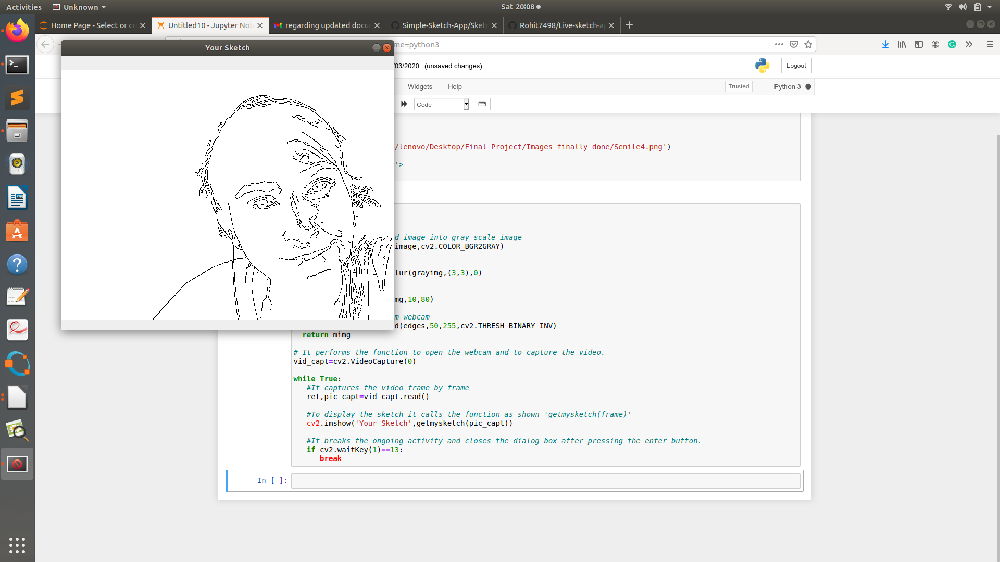

# Live-Sketch-App

This is a simple live sketch app using webcam with python libraries such as NumPy and OpenCV. 
<h1>Content</h1>

* [About](#About)
* [Output](#Output)
* [Requirements](#Requirements)
* [GettingStarted](#GettingStarted)

## About
In Sketch App, video is captured frame by frame using webcam and then sketch of the frame is displayed. Image processing methods like conversion to grayscale, gaussian blur etc are used and python libraries such as Numpy and OpenCV.

## Output

## Requirements
<ul>
  <li>Python 3.x</li>
  <li>OpenCV 2.x</li>
</ul

## Getting Started

<ul>
  <li>Download and import the requirements in jupyter notebook</li>
  <li>Clone the repository and paste it inside your jupyter notebook to run the app.</li>
</ul>

